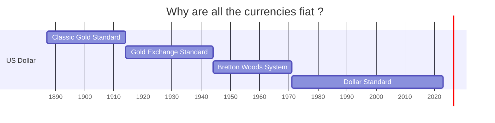

## History of the first fiat coin falling

 Around the same time India began minting coins, other regions, including Lidya, Europe, and China, began minting gold and silver coins of equal weight, making them fungible.

 When they arrived in Athens, one of the oldest named cities in the world, which has been continuously inhabited for approximately 5,000 years, their use exploded. It was the first civilization to have a tax system and a free market. They have produced outstanding works of art and architecture.

 Too much greed and too much war is what lead to their downfall. When Athens got involved in the Peloponnasian war: A war with Sparta, their problems began.
  - They lost access to their gold and silver mines.
  - They paid armies which were far away from athens, thus coinage started trickling out of Athens.
  - They debased their currency to pay for the war: By adding 50 percent copper to 1000 pure gold coins, we now have 2000 coins that can be used to pay for the war.

> Gresham's Law: Bad money drives out good money

As more "bad coins" with the same face value entered circulation, people began hoarding pure gold coins, thereby decreasing the supply and making them scarce. Suddenly, the pure gold coin was significantly more valuable than these copper coins, which, in theory, should have held the same value. This caused Athens to experience hyperinflation, and the resulting financial instability led to the collapse of their empire. 

## Seven Stages of Empire

This is a cycle of going from quality money to quantity currency, which keeps repeating over and over again, yet we learn nothing from it.

- **Stage 1**: We start with good money, usually gold or silver or money backed by them.
- **Stage 2**: This money is now used in the development of the nation and societal welfare.
- **Stage 3**: This money is now used to fund massive militaries.
- **Stage 4**: The empire uses this military and goes on a war. The expenditure explodes.
- **Stage 5**: The empire debases the currency to print unlimited amounts of it to fund the war.
- **Stage 6**: The population looses faith in this currency 
- **Stage 7**: People move from currency to gold and silver or tangible assets. The currency collapses and prices of gold and silver shoot up. The wealth gets transfered from people holding it in the form of currency to the people holding it in the form of money.

## The Current Scenario

During both World Wars, the United States did not become involved until the latter stages. For the majority of the war, the United States supplied the world with grains and consumer goods because other nations were preoccupied with training their young men for the war or preparing military equipment. At the end of World War II, the United States held 2/3rd of the world's gold reserves, while Europe had none. Europe received numerous dollar-denominated loans, resulting in a flood of dollars in the region.

In 1944, world leaders collaborated to create the Bretton Woods System in an effort to stabilise the currencies all across the world. Under this system, the majority of the world's currencies were now backed by the U.S. dollar, which was backed by gold.

However, no ratio defining the amount of gold reserve required to print a dollar had been established. So the US just kept printing the dollar. Some countries as a result, became worried and started asking US for gold in exchange for dollars. Between 1959-1971, in just 12 years, US lost half of its gold reserve. But 12 times more dollars were in circulation than the gold US had. In 1971, thus US declared, that it won't back its dollars with gold, and thus nearly all the currencies of the world became fiat currencies, and the world just agreed and went along.

